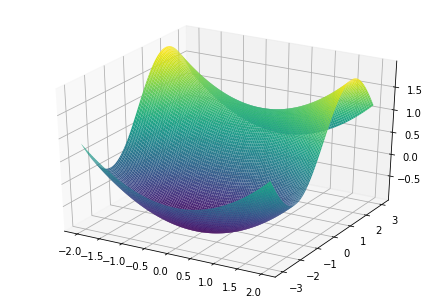

# ADAM from scratch
****

#####Discription
This is an implementation of the optimizer "ADAM" which was written from scratch
Here the minima of a 2d surface is calculated by using adam optimization.
*****
The surface used for this minimization is as below.

****
The minimization when sceen from the top view is as below.

